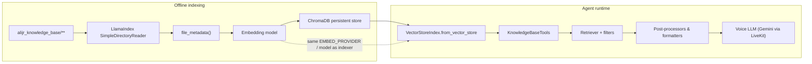

# AliJR RAG system — architecture and strategies

This document describes how retrieval-augmented generation (RAG) works in the Personal AI / AliJR stack: **what gets indexed**, **how vectors are stored**, **how the voice agent queries them**, and **which corrective / filtering strategies** apply. It reflects the current implementation in `rag_indexer.py` and `agent.py`.

---

## 1. High-level architecture

**Core idea:** All searchable prose lives under `alijr_knowledge_base/`. The **indexer** turns files into chunked documents with **consistent metadata**, embeds them, and writes vectors to **Chroma**. The **agent** loads the same collection read-only, embeds the user/tool query with the **same embedding configuration**, retrieves top‑k nodes, optionally **narrows by metadata**, applies **CRAG-style correction** for projects, then **formats** context for the LLM. **Resume content is deliberately not in the vector DB** — it is read from disk via a dedicated tool.

---

## 2. Knowledge layout and routing philosophy

### 2.1 Directory taxonomy (`folder_category`)

Indexed paths are grouped by **first path segment** under `alijr_knowledge_base/` (see `file_metadata()` in `rag_indexer.py`). The agent exposes these as the `FolderCategory` enum:

| Value | Role |
|--------|------|
| `submissions` | Course submissions, assignments |
| `research` | Papers, notes, research materials |
| `course_lectures` | Lecture exports, slides-as-text, HTML bundles, etc. |
| `projects` | Nested codebases / repos; extra metadata for repo identity |
| `all` | No folder filter — search entire KB |

**Projects** are special: each file gets `project_root` (top-level slug under `projects/`), `project_name` (parent folder name), and `project_keywords` (combined string for lexical overlap in embeddings and filtering hints).

### 2.2 Resume bypass (not RAG)

**Strategy:** CV / bio / employer / dates questions **must not** use vector search, to avoid hallucinated or fragmented CV answers.

- Tool: `read_resume_context` reads `alijr_knowledge_base/resume/resume.md` directly.
- The system prompt instructs the model to use **only** that tool for resume questions.

This is a **source-authoritative** pattern rather than similarity-based retrieval.

### 2.3 HTML and PDF handling

- **HTML / HTM:** Parsed with BeautifulSoup (`HtmlFileReader`): scripts/styles/templates removed; visible text + title/h1 preserved for embedding.
- **PDF:** Requires `llama-index-readers-file` and `pypdf`; without them, PDFs would be mis-read.

---

## 3. Indexing pipeline (`rag_indexer.py`)

### 3.1 Document loading

- **Reader:** `SimpleDirectoryReader` over `alijr_knowledge_base/`, recursive, hidden files excluded.
- **Extensions:** `.pdf`, `.md`, `.markdown`, `.txt`, `.html`, `.htm`.
- **IDs:** `filename_as_id=True` — stable paths as document IDs for incremental bookkeeping.
- **Per-file metadata:** `file_metadata(filepath)` attaches:

  - `file_path`, `file_name`
  - `folder_category` (first segment under KB root)
  - For `projects/` only: `project_root`, `project_name`, `project_keywords`

### 3.2 Embeddings and provider parity

Supported **`EMBED_PROVIDER`** values:

| Provider | Typical use | Notes |
|----------|-------------|--------|
| `ollama` | Local dev | `OLLAMA_EMBED_MODEL` (default `nomic-embed-text`), `OLLAMA_BASE_URL` |
| `gemini` | Vertex | `GEMINI_EMBED_MODEL` (default `text-embedding-004`), GCP credentials + project |

**Critical rule:** The agent’s `_configure_llama_index()` uses the **same** `EMBED_PROVIDER` and model selection logic for **query** embeddings. If indexer and agent disagree, retrieval quality collapses (wrong geometry in vector space).

### 3.3 Vertex embedding throughput and limits

When using Gemini embeddings:

- **`VertexEmbeddingRequestBudget`** wraps the embedder and **splits batches** so each HTTP request stays under ~20k-token style limits (`RAG_EMBED_MAX_CHARS_PER_REQUEST`, default `26000`).
- Tunables: `RAG_EMBED_BATCH_SIZE`, `RAG_EMBED_NUM_WORKERS`, `RAG_USE_ASYNC_EMBED`, `RAG_INSERT_BATCH_SIZE`, `RAG_VERTEX_EMBED_BATCH_CAP`, retry/backoff env vars documented in `rag_indexer.py` module docstring.

### 3.4 Storage and collection

- **Vector store:** `ChromaVectorStore` with collection name **`alijr_kb`**, persist dir **`chroma_db/`** (same `COLLECTION_NAME` / paths as `agent.py`).
- **Manifest:** `chroma_db/embedding_manifest.json` stores a descriptor of the embedding configuration. If it **changes**, the indexer **wipes** Chroma and rebuilds (avoiding mixed embedding spaces).

### 3.5 Incremental indexing

- **Fingerprints:** `chroma_db/index_file_state.json` stores `{doc_id: {mtime_ns, size}}` per source file.
- **Logic:** If docstore + Chroma already exist, the indexer **deletes** vectors for removed docs and **re-embeds** only changed/new docs (unless `RAG_FULL_REBUILD=1`).
- **PDF multi-part IDs:** Fingerprint resolution strips LlamaIndex `_part_N` suffixes when mapping back to disk paths.

---

## 4. Agent-side retrieval (`agent.py`)

### 4.1 Index loading

`KnowledgeBaseTools._load_index()`:

1. Calls `_configure_llama_index()` (embeddings + auxiliary LlamaIndex LLM defaults).
2. Opens `ChromaVectorStore.from_params(collection_name=alijr_kb, persist_dir=chroma_db)`.
3. Builds `VectorStoreIndex.from_vector_store(store)` — **no re-ingest** at runtime.

### 4.2 Primary tool: `search_documents`

**Inputs:**

- `query` — natural language (from the voice agent).
- `folder_category` — one of `FolderCategory`.
- `project_folder` — optional slug for `projects` scope (matches `project_root` / `project_name` in metadata).

**Execution:** The heavy pipeline runs in **`asyncio.to_thread`** to avoid blocking the event loop (`_execute_pipeline`).

---

## 5. Metadata filtering strategy

Implemented in `_build_metadata_filters()`:

| Scope | Filters applied |
|--------|------------------|
| `all` | **None** — unrestricted vector search over the whole KB |
| Non-`all` | Always `folder_category == <category>` |
| `projects` + empty `project_folder` | Only folder category (full projects tree) |
| `projects` + non-empty slug | `folder_category == projects` **AND** `(project_root == slug OR project_name == slug)` wrapped in an **OR** group |

**Slug normalization:** User/agent-provided `project_folder` is matched **case-insensitively** against the PageIndex list; if unknown, the slug is cleared and search widens to **all projects** with a trace note.

This design matches **physical folder layout** (`projects/<slug>/...`) while tolerating README files whose parent folder name aligns with `project_name`.

---

## 6. PageIndex and Gemini-based project resolution

### 6.1 What “PageIndex” means here

There is no separate vector index named PageIndex — it is the **authoritative list of top-level directories** under `alijr_knowledge_base/projects/`, computed at runtime (`_projects_page_index_slugs()`).

### 6.2 When Gemini chooses `project_root`

If `folder_category == projects` and **`project_folder` is empty**:

1. `_gemini_resolve_project_root_sync(query, candidates)` asks **`ALIJR_PROJECT_RESOLVER_MODEL`** (default `gemini-2.5-flash`) to output strict JSON: `{ "project_root": "<slug>" | null }`.
2. Parsing tolerates minor formatting issues (regex fallback, token overlap against query).

**Strategy:** Defer **ambiguous natural-language repo references** to a small, cheap structured classification step instead of relying on pure embedding similarity across many similar repos.

---

## 7. Vector retrieval parameters

Inside `_run_search_pass`:

- **Retriever:** `index.as_retriever(similarity_top_k=..., filters=...)`.
- **Defaults:** `ALIJR_RAG_TOP_K` (default **16**); for projects, `max(top_k, ALIJR_RAG_TOP_K_PROJECTS)` (default **24**).
- **Minimum k:** `similarity_top_k` is forced to **at least 8** for stability.

**Scores:** Logged as LlamaIndex/Chroma-style similarities; comments in `_filter_rag_nodes` note interpretation as **`exp(-chroma_distance)`** for preview logging — treat ranks as **soft signals**, not calibrated probabilities.

---

## 8. Fallback retrieval strategies

### 8.1 Projects: empty result with a narrow slug

If the first pass returns **no nodes** for `projects` **with** a non-empty slug:

- **Retry** once with **slug cleared** (search all projects).
- Rationale: missing or stale `project_root` metadata after indexer changes.

### 8.2 Similarity post-processing (`SimilarityPostprocessor`)

Used in:

- **Non-projects:** `_filter_rag_nodes`
- **Projects:** `_format_projects_readme_priority` (initial filter on picked nodes)

**Behavior:** Drops nodes below **`ALIJR_RAG_MIN_SIMILARITY`** (default **0.06**). If everything is filtered out:

- **Fallback:** keep the **strongest raw matches** (descending score) up to a small cap — avoids returning nothing on borderline queries.

### 8.3 OCR / noise heuristic

`_filter_rag_nodes` skips chunks that are **long (>100 chars)** but have **low alphabetic ratio** (`< 0.18`) — typical PDF/OCR garbage. If that empties the list:

- **Fallback:** return top **3** raw ordered hits anyway with a note.

### 8.4 Text cleanup for TTS / LLM consumption

`_clean_rag_excerpt` strips control characters, collapses whitespace/newlines, and trims on sentence or word boundaries up to **`max_chars`** (default **1400** for standard snippets). Optimized for **voice**: readable, continuous prose.

---

## 9. Corrective RAG (CRAG) for projects and global scope

**Goal:** Detect when retrieval is **good**, **insufficient**, or **ambiguous** relative to the user question and the known project slugs — and optionally **trigger a second retrieval** with a better `project_root`.

### 9.1 When CRAG runs

`run_crag` is **true** when `folder_category` is **`projects`** or **`all`**, and the first retrieval returned **non-empty** nodes.

### 9.2 Model and prompt

- Model: **`ALIJR_CRAG_MODEL`** (default `gemini-2.5-flash`).
- **`_crag_classify_sync`** sends: user query, folder scope, **short previews** of retrieved passages (file path + ~240 chars), and the **PROJECT_PAGE_INDEX** text list.

### 9.3 Verdicts

JSON schema (conceptually):

- `verdict`: `"GOOD" | "INSUFFICIENT" | "AMBIGUOUS"`
- `reason`: short string
- `suggested_project_root`: slug or `null`

### 9.4 Follow-up search

If **`AMBIGUOUS`**, scope is **`projects`**, and `suggested_project_root` is a **valid** slug **different** from the current resolved slug:

- Run **`_run_search_pass`** again with **`proj_slug=suggested`** (`crag_followup` in traces).

**Failure tolerance:** Exceptions append `CRAG skipped (...)` and continue — retrieval still usable without correction.

---

## 10. Output formatting strategies

After retrieval + CRAG, the pipeline branches:

### 10.1 Non-project categories (`submissions`, `research`, `course_lectures`, `all`)

1. **`_filter_rag_nodes`** → at most **`ALIJR_RAG_MAX_SNIPPETS`** (default **6**) snippets.
2. **`_format_standard_snippets`** builds numbered excerpts with metadata headers (`relevance`, `source`, `folder`, optional `project_*`).
3. Response header includes **`folder_category`** and optional **`project_root`**, plus **pipeline notes** (resolver, CRAG, filter notes).

### 10.2 Projects branch — README-centric merging

**Motivation:** Repo questions often need **coherent README narrative**, not tiny shards.

1. **Rank** raw nodes by score; take top **`max(max_snippets * 3, 16)`** pool.
2. **`_format_projects_readme_priority`**:
   - Apply **`SimilarityPostprocessor`** with the same **`ALIJR_RAG_MIN_SIMILARITY`**.
   - **Group nodes by `file_path`** preserving score ordering.
   - Merge chunks per file (dedupe identical bodies).
   - Per file: if estimated tokens **`≤ ALIJR_PROJECT_FULL_README_TOKEN_CAP`** (default **4000** × ~4 chars/token budget), include **full merged text**; else include a **large excerpt** (bounded char budget).
   - Emit at most **`ALIJR_PROJECT_README_SECTIONS`** (default **4**) file sections.

**Voice hint:** System prompt warns the model that project context may be **long** and should be **summarized faithfully** for speech.

---

## 11. Supporting tools

| Tool | Purpose |
|------|---------|
| `read_resume_context` | Single-file authoritative CV/bio text |
| `list_projects_page_index` | Human/agent-visible list of `projects/` slugs |
| `search_documents` | Primary vector RAG entry point |

---

## 12. Developer tracing (optional)

When dev trace is enabled (`dev_trace.py` + UI / env):

- **stderr:** Full `panel()` output for retrieval passes, CRAG JSON, hit lists.
- **UI:** Compact summaries over LiveKit data packets (high-level “how retrieval proceeded”), configurable via `ALIJR_DEV_WIRE_SUMMARY`.

This does not change retrieval logic; it **observes** it.

---

## 13. Environment variables reference

### Indexing (`rag_indexer.py`)

| Variable | Role |
|----------|------|
| `EMBED_PROVIDER` | `ollama` or `gemini` |
| `OLLAMA_*`, `GEMINI_EMBED_MODEL` | Embedding endpoints/models |
| `GOOGLE_APPLICATION_CREDENTIALS`, `GOOGLE_CLOUD_PROJECT`, `GOOGLE_CLOUD_LOCATION`, `GOOGLE_CLOUD_QUOTA_PROJECT` | Vertex / GCP |
| `RAG_EMBED_*`, `RAG_INSERT_BATCH_SIZE`, `RAG_VERTEX_EMBED_BATCH_CAP` | Throughput / batching |
| `RAG_FULL_REBUILD` | Force full Chroma wipe |
| `RAG_QUIET_PYPDF` | Silence noisy PDF logs |

### Retrieval (`agent.py`)

| Variable | Default | Role |
|----------|---------|------|
| `ALIJR_RAG_MIN_SIMILARITY` | `0.06` | Similarity post-processor cutoff |
| `ALIJR_RAG_MAX_SNIPPETS` | `6` | Cap for non-project snippets |
| `ALIJR_PROJECT_README_SECTIONS` | `4` | Max README “sections” (files) in project responses |
| `ALIJR_RAG_TOP_K` | `16` | Base retriever top‑k |
| `ALIJR_RAG_TOP_K_PROJECTS` | `24` | Minimum floor for projects top‑k |
| `ALIJR_CRAG_MODEL` | `gemini-2.5-flash` | CRAG classifier model |
| `ALIJR_PROJECT_RESOLVER_MODEL` | `gemini-2.5-flash` | Slug resolver model |
| `ALIJR_CRAG_THINKING_BUDGET` | `8192` | Thinking budget for CRAG |
| `ALIJR_PROJECT_THINKING_BUDGET` | `2048` | Thinking budget for resolver |

Constants in code (not env): **`_ALIJR_PROJECT_FULL_README_TOKEN_CAP = 4000`**, **`_ALIJR_CHARS_PER_TOKEN = 4`** for README size budgeting.

---

## 14. Operational checklist

1. **Add or update files** under `alijr_knowledge_base/…`.
2. **Run** `python rag_indexer.py` (same machine/env as production indexer ideally).
3. **Ensure** agent **`EMBED_PROVIDER`** matches what built `chroma_db/`.
4. If embeddings **model or provider changed**, expect manifest-driven **full rebuild** or run with explicit wipe.
5. For **projects**, confirm folders exist under `projects/<slug>/` and indexer populated **`project_root`** metadata.
6. For **resume**, maintain `resume/resume.md`; no re-index needed for resume-only edits.

---

## 15. Design summary (strategies at a glance)

| Strategy | Where | Why |
|----------|--------|-----|
| Folder-scoped metadata filters | Indexer + retriever | Isolate coursework vs research vs codebases |
| Dual project keys (`project_root` OR `project_name`) | Metadata filter OR-group | Match varied directory/README layouts |
| PageIndex slug list | Filesystem + tools | Ground-truth repo identifiers |
| Gemini slug resolver | Empty `project_folder` | Map vague NL → single repo |
| Higher top‑k for projects | Retriever | More shards before README merge |
| Similarity threshold + fallbacks | Post-processors | Reduce junk while avoiding empty results |
| OCR / alphabetic-ratio filter | `_filter_rag_nodes` | Drop garbage PDF chunks |
| CRAG second pass | Gemini verdict | Correct wrong repo scope |
| README merge + token cap | Projects formatter | Coherent long context for code questions |
| Resume filesystem tool | Bypass vectors | Authoritative CV answers |

---

*Last aligned with the codebase layout under `rag_indexer.py`, `agent.py`, and `dev_trace.py`. If behavior diverges, treat source files as authoritative.*
